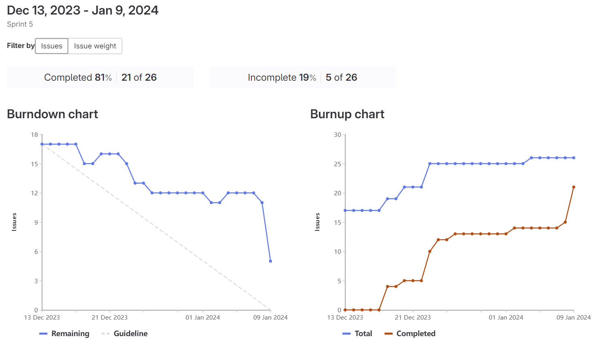
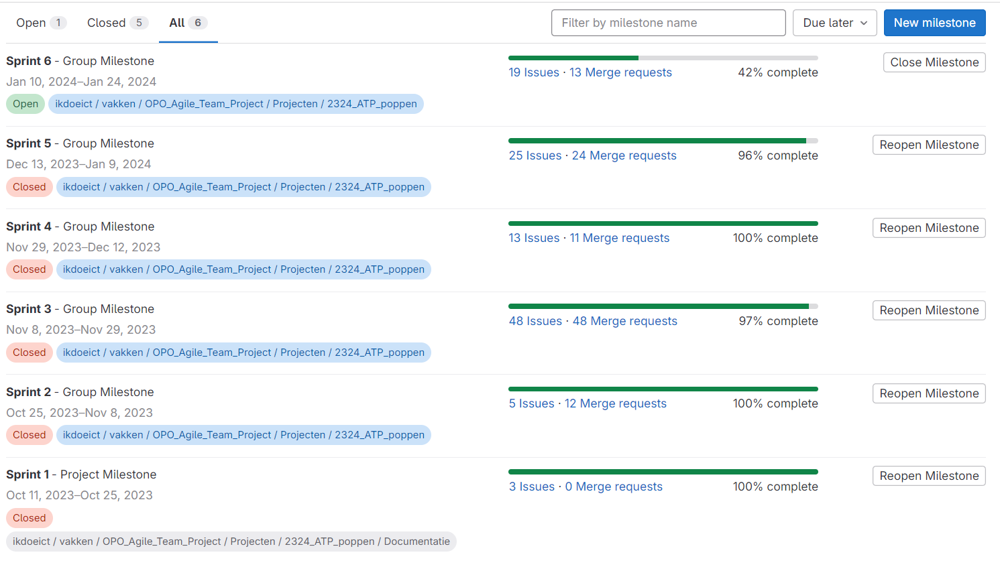

# Eindverslag
## Project Doelstelling
Het Huis Van Alijn is gestart met de restauratie van een van hun ruimtes en had behoefte aan een applicatie waarmee bezoekers hun collectie poppen kunnen ontdekken. In de gerenoveerde ruimtes worden touch-screen schermen geïnstalleerd waarop onze applicatie zal draaien. De applicatie heeft drie hoofddoelen:

1. Het ontdekken van alle poppen door ze te classificeren in zes verschillende kamers.
2. Een spel waarin bezoekers verschillende speeltechnieken kunnen leren aan de hand van demonstratievideo's.
3. Een scènemaker waarmee bezoekers hun eigen scène kunnen samenstellen met poppen uit de collectie.

## Applicatie-uitleg
### Game Pagina
Op de game pagina kunnen bezoekers een memory game spelen die elke keer anders is. Bezoekers moeten de juiste pop koppelen aan de overeenkomstige speelstijl. Wanneer dit correct is gedaan, verschijnt er een video op het scherm met extra informatie over die speelstijl.

### Kamer Pagina's
Er zijn zes kamerpagina's, elk met een andere collectie poppen (bijv. de superheldenkamer bevat alle superheldenpoppen). Bezoekers kunnen door de poppencollectie bladeren. Wanneer ze een pop selecteren, verschijnt er extra informatie over die pop aan de rechterkant. De poppen bevatten informatie zoals jaar, maker, beschrijving, en een lijst met gerelateerde objecten.

### scènemaker Pagina
In de scènemaker kunnen bezoekers poppen, tekstballonnen en achtergronden kiezen om hun eigen scène te ontwerpen. Als ze daarna op de knop "scène exporteren" drukken, wordt deze scène samen met de laatste twintig scènes opgeslagen en gebruikt als inactivity screen.

## Analyse en Reflectie
### Uitdagingen
Na wat onderzoek en trial-and-error is het ons gelukt om de app automatisch te laten opstarten op de NUC.\
De data die we van de klant hebben ontvangen, was in Word-bestanden. Het schrijven van seeders om de data van de Word-bestanden naar de database te migreren was niet eenvoudig. \
Sommige vertalingen in de Word-bestanden waren niet correct en moesten we handmatig aanpassen. \

### Beslissingen
We hebben gekozen voor ReactJS vanwege zijn Component-based structuur, grote community, talloze libraries, en uitstekende prestaties. \
Laravel wordt gebruikt als API vanwege zijn MVC-architectuur, goede beveiliging en grote community. \
MySQL is onze databasekeuze vanwege zijn relationele karakter, wat perfect geschikt is voor de ontvangen klantdata. \
Onze website, API en database draaien op een eigen server zonder de noodzaak van load balancers, omdat de website lokaal op een NUC draait zonder internetverbinding. \

#### Keuze van Kiosk Software

### Grafieken
Dit is een screenshot van onze beste sprint waar we de meeste issues hebben afgewerkt.

Dit is een screenshot van onze milestones

### Scrum
Ons issue board bestaat uit 5 lijsten:
- **Open**: Hierin staan al onze issues die nog moeten afgewerkt worden
- **Todo**: Hierin worden al de issues geplaatst die we van plan zijn in de volgende sprint af te werken
- **Doing**: Als er iemand begint met een issue wordt die in deze lijst gesleept en van deze issue wordt dan een aparte branch gemaakt (Branching strategy: Styles > Strategy)
- **QA**: Wanneer er een merge request gemaakt van de feature-branch naar de development branch wordt deze issue in QA geplaatst tot dat er goedkeuring is van de merge request door andere teamleden
- **Done**: Wanneer de issue voldoet aan de DoD, dan kan de issue naar **Done** versleept worden (DoD: Extra > DoD)

### Branching strategy
De branching strategy wordt voluit uitgelegd in Styles > Strategy

### Sprints
Standup en retrospective verslagen staan in Sprints > Sprint # > Standup / Retrospective

## Voortgang Gedurende het Project
Het begin van het project verliep niet erg soepel, aangezien we moesten onderzoeken hoe GitLab samenwerkt met het Scrum-framework. Dit werd doorheen het project beter.

## Teamfeedback
Het plannen van de stand-up meetings verliep niet vlot. \
Niet iedereen was altijd op tijd aanwezig. \
Tijdens de vakantie was er weinig vooruitgang in het project, hoewel dit wel nodig was. \
De laatste week voor het einde van het project was er betere samenwerking vanwege de toenemende druk.

## Klantinteractie
### Eerste Ontmoeting
Tijdens ons eerste gesprek hebben we gevraagd waar we de data konden vinden en hoe ze zich de applicatie voorstelden. Het werd duidelijk dat de klant drie verschillende pagina's wilde (kamers, game en scènemaker pagina).

### Tweede Ontmoeting
Tijdens de tweede ontmoeting werden enkele aanvullingen en stijlpunten besproken, zoals de plaats van knoppen, tips voor de scènemaker, de behoefte aan multitouch, en het aantal seconden voordat een inactivity screen verschijnt. In het algemeen was de klant zeer blij met wat we al bereikt hadden zover.

### Extra
Extra informatie over de gesprekken met de klant kunnen terug gevonden worden in Feedback > Customer

## Uitvoeren van de applicatie
1. Installatie Docker Desktop
2. Clone main branch van de repository van gitlab (Infra & web).
3. Uitvoeren van volgende commando's bij Infra (Backend): docker compose up -d php-web
4. Uitvoeren van volgende commando's bij web (Frontend): docker compose up -d nginx
5. Surfen naar localhost:81

## Extra Bronnen
Swagger documentatie: [https://swagger.io/docs](https://swagger.io/docs) \
Docker hub: [https://hub.docker.com/](https://hub.docker.com/) \
Laravel: [https://laravel.com/docs/10.x/readme](https://laravel.com/docs/10.x/readme)  \
ReactJS: [https://react.dev/](https://react.dev/)