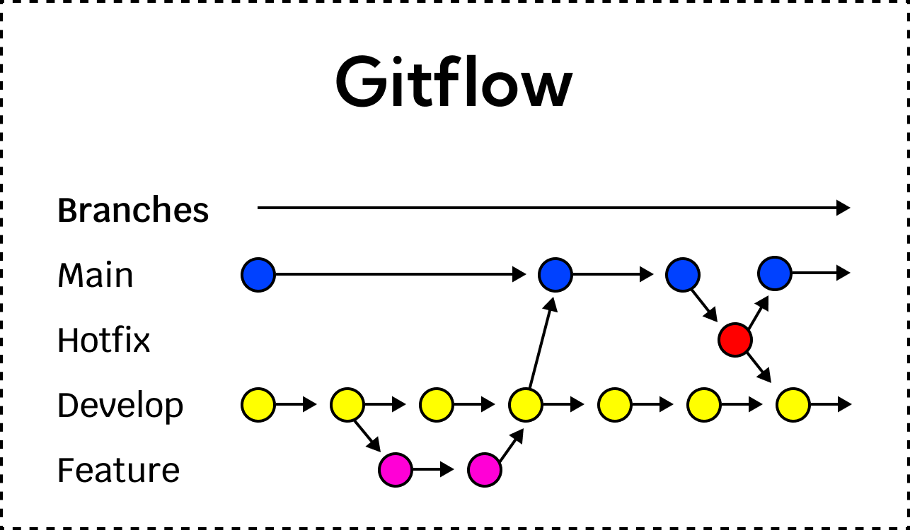

# Branching strategy
One main branch for production \
One development branch for development and feature design \
Seperate issues are created from the development branch and merged after completed \ 

